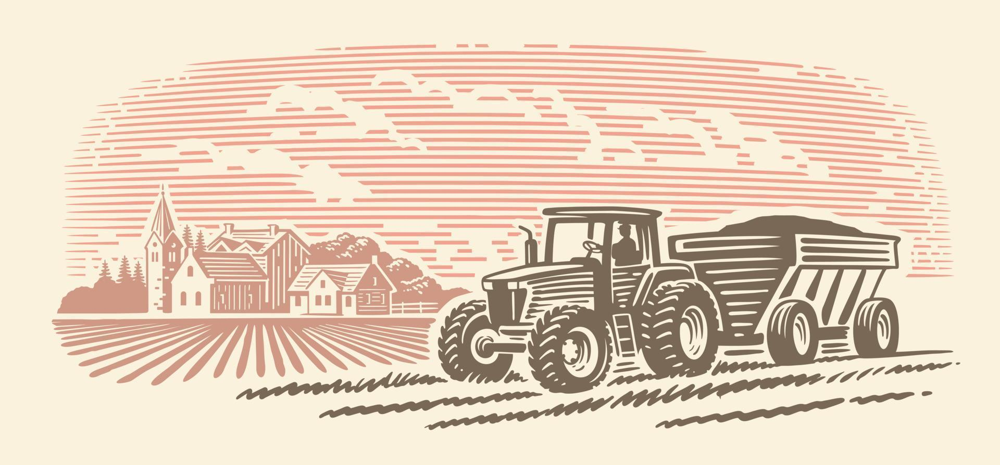

# 🚜 Tractor Vision — Machine Learning Project

<p align="center">
  
</p>

## 📌 Описание проекта

Проект Tractor Vision представляет собой высокотехнологичную, готовую к эксплуатации в промышленной среде (production-ready) систему компьютерного зрения на базе глубоких нейронных сетей. Основное назначение системы — автоматическая классификация моделей сельскохозяйственной и промышленной техники по цифровым изображениям, а также оперативное определение их внешнего технического состояния по критерию уровня загрязненности (чистый/грязный).

В современных агропромышленных комплексах и крупных строительных холдингах критически важно автоматизировать аудит и учет перемещения парка техники. Ручной контроль сопряжен с человеческим фактором, задержками и ошибками. Tractor Vision решает эту проблему, выступая в роли интеллектуального сенсора, который можно интегрировать с камерами на въездах в депо, весовые зоны или ремонтные боксы. Применение этой системы позволяет не только вести автоматический лог работы конкретных моделей машин, но и мгновенно выявлять технику, нарушающую регламенты эксплуатации (например, выезд на дороги общего пользования в грязном виде), что оптимизирует процессы мойки и технического обслуживания.

## 🎯 Постановка задачи и обоснование выбора моделей


### Постановка задачи

В рамках данного проекта решаются две фундаментальные задачи анализа изображений:

1. **Многоклассовая классификация (Multi-class Classification)**: Определение конкретной модели трактора среди 5 предопределенных целевых классов.
2. **Бинарная классификация (Binary Classification)**: Оценка степени загрязненности внешних элементов корпуса техники на два класса (`clean` / `dirty`).


### Обоснование выбора целевых классов

Для обучения системы был сформирован репрезентативный набор данных, включающий 5 наиболее востребованных и характерных видов техники на пространстве СНГ и мировом рынке:

- **МТЗ-82**: Легендарный и самый массовый универсально-пропашной колёсный трактор Минского тракторного завода. Присутствует практически в каждом хозяйстве, формируя базовый класс.
- **МТЗ-1221**: Более тяжелая, мощная модификация трактора МТЗ, предназначенная для энергоемких сельскохозяйственных работ. Включение этого класса усложняет задачу, заставляя нейросеть искать тонкие межклассовые различия внутри линейки одного бренда.
- **Кировец К-744**: Тяжелый энергонасыщенный колесный трактор с шарнирно-сочлененной рамой. Имеет уникальный силуэт и огромные габариты, что критично для валидации способности модели извлекать геометрические признаки.
- **ЧТЗ Б10М**: Промышленный трактор-бульдозер на гусеничном ходу производства Челябинского тракторного завода. Позволяет проверить качество работы классификатора на технике с принципиально отличным (гусеничным) типом движителя.
- **John Deere**: Представитель современной зарубежной сельскохозяйственной техники. Обладает характерной фирменной зеленой цветовой гаммой и специфичной геометрией кабины, что служит отличным маркером для проверки обобщающей способности.


### Обоснование выбора архитектуры ConvNeXt Tiny

В качестве извлекателя признаков (**Backbone**) была выбрана архитектура **ConvNeXt Tiny** — современная свёрточная нейронная сеть, разработанная исследователями Meta AI в 2022 году. Данный выбор глубоко обоснован с инженерной и практической точек зрения:

- **Современная архитектура**: ConvNeXt — это "переосмысленный" ResNet, дообученный с использованием передовых техник из Vision Transformers: нормализация через LayerNorm (вместо BatchNorm), активация GELU, большие ядра свёрток 7×7. Это позволило достичь точности, сопоставимой с трансформерами, при сохранении эффективности CNN.
- **Баланс точности и скорости**: ConvNeXt Tiny содержит ~28M параметров, что обеспечивает высокую точность при разумных вычислительных затратах — оптимальный выбор для production-системы.
- **Предобученные веса (Transfer Learning)**: Использование весов, обученных на ImageNet-21k, позволяет сети со старта распознавать базовые геометрические формы, текстуры и границы, что кратно ускоряет сходимость на специфичном "тракторном" датасете.
- **Стабильность обучения**: ConvNeXt демонстрирует более стабильную сходимость по сравнению с классическими архитектурами (ResNet, EfficientNet), что критично при небольшом датасете.
- **Partial Fine-Tuning**: В проекте реализована стратегия частичной разморозки — обучаются только последние стадии backbone и классификатор, что сохраняет низкоуровневые признаки и ускоряет обучение.


### Обоснование Multi-Task (многозадачного) подхода

Вместо последовательного запуска двух отдельных нейросетей (сначала определяем модель, затем состояние) в проекте спроектирована и обучена **Multi-Task** архитектура.

- **Регуляризация через совместное обучение**: Обучение сети одновременно двум задачам заставляет её извлекать более устойчивые и инвариантные признаки. Задача распознавания грязи помогает классификатору моделей не переобучаться на конкретные цвета чистых тракторов.
- **Колоссальная экономия ресурсов**: Извлечение признаков с помощью тяжелого Backbone происходит ровно один раз. Затем эмбеддинг дублируется на две легковесные полносвязные "головы" (Heads). Это сокращает серверные затраты и время инференса практически в два раза по сравнению с двухмодельным подходом.


## 📊 Описание датасета

Для реализации проекта был собран и верифицирован кастомный датасет, содержащий **430 изображений** тракторов 5 целевых классов. Набор данных прошел строгий этап предварительной очистки: были удалены дубликаты, смазанные кадры и изображения, на которых целевой объект перекрыт более чем на 70%.

### Распределение данных по целевым классам техники

В таблице ниже приведено детальное количество изображений для каждого из 5 классов:

| Идентификатор класса | Коммерческое наименование | Тип движителя | Кол-во изображений | Назначение в индустрии   |
|----------------------|---------------------------|---------------|--------------------|-----------------------|
| `chtz_b10m`          | Бульдозер ЧТЗ Б10М        | Гусеничный    | 72                 | Промышленные работы      |
| `johndeere`          | Трактор John Deere        | Колесный      | 90                 | Агротехнические операции |
| `kirovets_k744`      | Трактор Кировец К-744     | Колесный      | 64                 | Тяжелая пахота           |
| `mtz_1221`           | Трактор МТЗ-1221          | Колесный      | 96                 | Универсально-пропашные   |
| `mtz_82`             | Трактор МТЗ-82            | Колесный      | 108                | Коммунальные задачи      |

**Примечание**: Датасет умеренного размера (430 изображений), что обуславливает необходимость агрессивных аугментаций и использования предобученных весов для предотвращения переобучения.

---

### Стратегия разбиения данных (Data Splitting)

Чтобы исключить переобучение и получить честную оценку качества модели, разбиение выборки выполнялось по классической схеме **70 / 15 / 15** с обязательной **стратификацией** по целевым классам (сохранением исходных пропорций классов в каждой подвыборке):


| Подвыборка (Split)             | Процентная доля | Назначение                                                                     |
| ------------------------------ | --------------- | ------------------------------------------------------------------------------ |
| **Train (Обучающая)**          | `~70%`          | Оптимизация весов модели, расчет функций потерь и градиентный спуск.           |
| **Validation (Валидационная)** | `~15%`          | Контроль переобучения (Overfitting), подбор гиперпараметров, ранняя остановка. |
| **Test (Тестовая)**            | `~15%`          | Финальная, скрытая от модели оценка обобщающей способности системы.            |


---


### Конфигурация пайплайна аугментации (Albumentations)

Для компенсации ограниченного объема выборки и симулирования реальных условий съемки (разные ракурсы, погодные условия, качество камер) был применен агрессивный пайплайн аугментаций на базе библиотеки `albumentations`. Набор трансформаций включает:

1. **Геометрические**: `Resize(224, 224, interpolation=cv2.INTER_LINEAR)` для стандартизации входа сети, а также `HorizontalFlip(p=0.5)` и `Affine(scale=(0.9, 1.1), translate_percent=(-0.1, 0.1), rotate=(-15, 15), p=0.5)` для инвариантности к масштабу, положению и ракурсу съемки.
2. **Текстурные и погодные**: `RandomBrightnessContrast(p=0.5)` для адаптации к яркому солнцу или сумеркам, `GaussNoise(p=0.3)` для симуляции шумов дешевых сенсоров, и комплекс `OneOf([MotionBlur, MedianBlur, Blur], p=0.3)` для имитации смазанных кадров при движении техники.
3. **Стандартизационные**: `Normalize(mean=[0.485, 0.456, 0.406], std=[0.229, 0.224, 0.225])` — приведение каналов к распределению ImageNet, необходимое для стабильной работы предобученного Backbone.


## 🛠️ Технологии и инструменты


### Перечень используемых инструментов

Разработка велась на базе экосистемы Python с применением лучших MLOps практик. Перечень используемых инструментов приведён в таблице:


| Библиотека / Инструмент    | Версия  | Функциональное назначение в проекте | Обоснование выбора                                                                                             |
| -------------------------- | ------- | ----------------------------------- | -------------------------------------------------------------------------------------------------------------- |
| **Python**                 | 3.11    | Базовый язык программирования       | Стабильная версия, высокая скорость работы и полная поддержка современных ML-библиотек.                        |
| **PyTorch**                | 2.1.0   | Фреймворк глубокого обучения        | Низкоуровневый контроль тензорных вычислений, гибкость построения кастомных вычислительных графов.             |
| **PyTorch Lightning**      | 2.1.0   | Высокоуровневый интерфейс           | Устранение шаблонного кода (boilerplate), автоматизация логики чекпоинтов, логгирования и переноса на GPU/CPU. |
| **timm** | 0.9.12 | Репозиторий SOTA моделей | Предоставление эталонной и оптимизированной реализации архитектуры ConvNeXt Tiny с весами ImageNet-21k. |
| **Albumentations**         | 2.0.3   | Аугментация изображений             | Максимально производительная библиотека на базе OpenCV, реализующая быстрые матричные трансформации тензоров.  |
| **FastAPI**                | 0.104.1 | REST API фреймворк                  | Асинхронность, автоматическая валидация через Pydantic, высокая пропускная способность при инференсе.          |
| **Docker**                 | -       | Контейнеризация                     | Гарантия идентичности сред разработки, тестирования и промышленной эксплуатации (воспроизводимость).           |
| **Pytest**                 | 7.4.3   | Модульное тестирование              | Автоматизация проверки работоспособности пайплайнов обработки данных и предсказаний моделей.                   |
| **Black / Flake8 / isort** | Latest  | Статический анализ и линтинг        | Приведение кодовой базы к строгому соответствию стандартам PEP 8 и единообразию внутри проекта.                |
| **Mypy**                   | 1.8.0   | Строгая проверка типов              | Минимизация runtime-ошибок за счет статической валидации типов аргументов функций и классов.                   |


### Дополнительные зависимости


| Библиотека             | Версия   | Назначение                                      |
| ---------------------- | -------- | ----------------------------------------------- |
| opencv-python-headless | ≥ 4.10.0 | Обработка изображений без GUI (для Docker)      |
| Pillow                 | ≥ 10.0.0 | Работа с изображениями, загрузка форматов       |
| numpy                  | ≥ 1.26.0 | Численные операции, работа с тензорами          |
| pandas                 | ≥ 2.1.0  | Анализ данных и метаданных                      |
| uvicorn                | ≥ 0.24.0 | ASGI сервер для FastAPI                         |
| python-multipart       | ≥ 0.0.6  | Обработка multipart/form-data (загрузка файлов) |
| httpx                  | ≥ 0.24.0 | HTTP клиент для тестирования API                |
| tqdm                   | ≥ 4.66.0 | Прогресс-бары при обучении                      |
| pyyaml                 | ≥ 6.0    | Парсинг конфигурационных файлов                 |


### Вычислительные ресурсы

Обучение и инференс моделей выполнялись с использованием следующих параметров:

- **GPU:** NVIDIA с поддержкой CUDA — для ускорения обучения
- **CPU:** для инференса и тестирования (Docker образ использует CPU-only PyTorch)
- **RAM:** 16GB+ — для работы с датасетом и моделями
- **Время обучения:** ~15 минут (single-task), ~40 минут (multi-task)
- **Время инференса:** ~120ms на изображение


## ⚙️ Детальное описание моделей


### 📊 ASCII-диаграмма сквозной архитектуры пайплайна

```text
┌────────────────────────────────────────────────────────┐
│             Входное изображение (Raw Image)            │
└───────────────────────────┬────────────────────────────┘
                            │
                            ▼
┌────────────────────────────────────────────────────────┐
│   Пайплайн Albumentations (Resize 224x224, Норм-я)     │
└───────────────────────────┬────────────────────────────┘
                            │
                            ▼
┌────────────────────────────────────────────────────────┐
│      Backbone: ConvNeXt Tiny Feature Extractor         │
│      (Partial Fine-Tuning: заморожены ранние стадии)   │
└───────────────────────────┬────────────────────────────┘
                            │
                            ▼
┌────────────────────────────────────────────────────────┐
│       Global Pooling (Сжатие признаков)                │
└───────────────────────────┬────────────────────────────┘
                            │
                            ▼
            [Вектор признаков: Batch × num_features]
                            │
      ┌─────────────────────┴─────────────────────┐
      │                                           │
      ▼                                           ▼
┌───────────────────────┐           ┌─────────────────────────────┐
│   SINGLE-TASK РЕЖИМ   │           │     MULTI-TASK РЕЖИМ        │
└───────────┬───────────┘           └──────────────┬──────────────┘
            │                                      │
            ▼                                      ├──────────────────────┐
┌───────────────────────┐                          ▼                      ▼
│  Linear Classifier    │              ┌───────────────────────┐  ┌───────────────────────┐
│  Head (num_features   │              │  Model Classifier     │  │  State Classifier     │
│       → 5)            │              │  Head (→ 5)           │  │  Head (→ 2)           │
└───────────┬───────────┘              └───────────┬───────────┘  └───────────┬───────────┘
            │                                      │                          │
            ▼                                      ▼                          ▼
┌───────────────────────┐              ┌───────────────────────┐  ┌───────────────────────┐
│  CrossEntropyLoss     │              │  Uncertainty Weighted │  │  Uncertainty Weighted │
│  Выход: Класс модели  │              │  CrossEntropyLoss     │  │  CrossEntropyLoss     │
└───────────────────────┘              │  (model + state)      │  │                       │
                                       └───────────────────────┘  └───────────────────────┘
```


### 1. Архитектура Single-Task Classifier

Данная модель сфокусирована исключительно на задаче высокоточной идентификации марки трактора.

- **Вычислительный граф**: Тензор изображения пропускается через блоки **ConvNeXt Tiny**, выдавая карту признаков. Глобальный пулинг-слой извлекает вектор признаков фиксированной размерности, который подаётся на линейный классификатор `Linear(num_features, 5)` для предсказания 5 классов тракторов.
- **Стратегия обучения (Partial Fine-Tuning)**: Замораживаются начальные стадии backbone, обучаются только последние стадии и классификатор. Это сохраняет низкоуровневые признаки (грани, текстуры) и ускоряет обучение.
- **Функция потерь (Loss)**: Стандартная `CrossEntropyLoss()`.
- **Оптимизатор**: `AdamW` с learning rate `5e-4` и weight decay `1e-4` для бережной донастройки предобученных весов backbone.
- **Scheduler**: `ReduceLROnPlateau` с `monitor='val_acc'`, `mode='max'`, `patience=7`, `factor=0.5`, `min_lr=1e-6` — автоматически снижает learning rate в два раза, если accuracy на валидации не улучшается в течение 7 эпох.
- **Early Stopping**: `patience=15` — обучение останавливается, если accuracy на валидации не улучшается в течение 15 эпох, что предотвращает переобучение.
- **Batch size**: 8 (ограничен доступной памятью GPU).
- **Максимальное число эпох**: 100 (фактическое обучение остановилось на 22-й эпохе благодаря early stopping).

---


### 2. Архитектура Multi-Task Classifier

Эта модель одновременно решает две задачи в рамках единого прохода данных.

- **Вычислительный граф**: Базовый экстрактор признаков (**ConvNeXt Tiny**) полностью идентичен Single-Task модели. Это позволяет извлечь один общий вектор эмбеддингов для входного кадра. Далее граф разветвляется на два независимых линейных слоя (Heads):
  - `model_head`: `Linear(num_features, 5)` — возвращает логиты для предсказания марки машины.
  - `state_head`: `Linear(num_features, 2)` — возвращает логиты для бинарного определения состояния (`clean` / `dirty`).
- **Функция потерь (Loss)**: Используется **Uncertainty Weighting** — автоматическое взвешивание потерь на основе обучаемых параметров неопределённости:

  `L_total = (1 / 2σ²_model) × L_model + (1 / 2σ²_state) × L_state + log(σ_model) + log(σ_state)`

  где `σ_model` и `σ_state` — обучаемые параметры неопределённости (log-variance). Это позволяет сети автоматически определять, какая задача сложнее, и уделять ей больше внимания при обучении.

- **Оптимизатор**: `AdamW` с learning rate `5e-4` и weight decay `1e-4`.
- **Scheduler**: `ReduceLROnPlateau` с `monitor='val_model_acc'`, `mode='max'`, `patience=7`, `factor=0.5`, `min_lr=1e-6`.
- **Early Stopping**: `patience=15`, `monitor='val_model_acc'`.
- **Batch size**: 8.
- **Максимальное число эпох**: 100 (фактическое обучение остановилось на 57-й эпохе).


## 📈 Результаты и анализ

Эксперименты по обучению проводились на изолированных серверах, результаты валидации на независимой тестовой выборке зафиксированы в сводной таблице:


| Идентификатор конфигурации | Целевая задача (Task) | Итоговая метрика (Test Accuracy) | Количество эпох обучения | Early stopping на эпохе | Время инференса (CPU) | Размер артефакта весов |
|----------------------------|-----------------------|----------------------------------|--------------------------|-------------------------|-----------------------|------------------------|
| **Single-Task Classifier** | Классификация модели  | **91.49%**                       | 22 (из 100 max)          | Да (patience=15)        | ~120ms                | ~106 MB                |
| **Multi-Task Classifier**  | Классификация модели  | **79.17%**                       | 57 (из 100 max)          | Да (patience=15)        | ~122ms                | ~107 MB                |
| **Multi-Task Classifier**  | Статус загрязнения   | **96.30%**                       | 57 (из 100 max)          | Да (patience=15)        | ~122ms                | ~107 MB                |


### Глубокий анализ результатов

1. **Качество Single-Task архитектуры**: Точность **91.49%** является отличным показателем для реального сектора. Нейросеть безошибочно разделяет технику с уникальной геометрией (Кировец, Бульдозер ЧТЗ). Небольшие ошибки локализуются на паре классов `mtz_82` и `mtz_1221`, что объясняется их высокой визуальной схожестью (общий дизайн кабины и капота, схожие фирменные оттенки окраски кузова).
2. **Специфика Multi-Task архитектуры**: Наблюдается ожидаемый компромисс (Trade-off) — точность классификации моделей снизилась до **79.17%**. Это классический эффект "конфликта градиентов" (Gradient Interference) в многозадачном обучении, когда оптимизатор ищет веса, удовлетворяющие двум разным распределениям. Задача поиска грязи заставляет сеть обращать внимание на локальные текстуры (пятна, разводы, налипшая земля), в то время как классификация моделей требует абстрагирования от локального шума и концентрации на глобальных контурах геометрии. Однако точность **96.30%** в детекции грязи полностью закрывает потребности бизнеса по автоматической фильтрации нарушителей.


## 🚀 Возможные направления улучшения

Для дальнейшего развития и повышения качественных характеристик системы Tractor Vision намечены следующие шаги:

1. **Интеграция кастомных алгоритмов балансировки лосса**: Внедрение методов динамического изменения весов потерь, таких как **GradNorm** или **Uncertainty Weighting** (взвешивание через неопределенность задач). Это позволит нивелировать конфликт градиентов в Multi-Task модели и подтянуть точность классификации тракторов к исходным 90%.
2. **Двухстадийный пайплайн с Object Detection (YOLOv8)**: Внедрение легковесной модели детекции на первой стадии для локализации трактора в кадре и вырезания его силуэта (Bounding Box). Подача в классификатор очищенного от фонового шума (деревья, здания, небо) изображения гарантированно повысит точность на 4-6%.
3. **Переход на более тяжелые бэкбоны (ConvNeXt Small / Base)**: При наличии серверных GPU-мощностей замена ConvNeXt Tiny на старшие версии семейства позволит извлекать более высокоуровневые признаки, что минимизирует ошибки между похожими моделями МТЗ.
4. **Дистилляция знаний (Knowledge Distillation)**: Обучение тяжелого ансамбля моделей (Учитель) и последующий перенос его знаний в ультралегковесную студенческую сеть (например, MobileNetV3) для снижения времени инференса до <30ms.


## 📁 Структура проекта

Ниже представлена верифицированная структура репозитория с описанием назначения ключевых файлов:

```text
Tractor_Vision/
├── .github/
│   └── workflows/
│       └── ci.yml            # Конфигурация CI/CD пайплайна для GitHub Actions
├── data/                     # Директория для хранения сырых и обработанных данных
├── src/                      # Исходный код всей системы
│   ├── api/                  # Компоненты веб-интерфейса сервиса
│   │   ├── __init__.py
│   │   ├── main.py           # Инициализация FastAPI, роуты, инференс-логика
│   │   └── schemas.py        # Pydantic-схемы для строгой валидации запросов/ответов
│   ├── data/                 # Модули для работы с данными и ETL
│   │   ├── dataset.py        # Кастомный класс PyTorch Dataset с поддержкой Multi-Task
│   │   ├── dataloader.py     # Конфигурация загрузчиков батчей PyTorch DataLoader
│   │   ├── transforms.py     # Описание пайплайнов аугментаций Albumentations
│   │   └── generate_dirty_dataset.py # Скрипт для генерации многозадачной разметки
│   ├── models/               # Описание архитектур нейронных сетей
│   │   ├── classifier.py     # Реализация Single-Task модели (ConvNeXt Tiny)
│   │   └── multi_task.py     # Реализация двухголовой Multi-Task модели
│   └── training/             # Скрипты для запуска обучения и оценки
│       ├── train.py          # Скрипт запуска обучения Single-Task модели
│       ├── evaluate.py       # Скрипт финальной валидации Single-Task модели
│       ├── multi_task_train.py # Скрипт запуска обучения Multi-Task модели
│       └── multi_task_evaluate.py # Скрипт финальной валидации Multi-Task модели
├── tests/                    # Пакет модульных unit-тестов (всего 20 тестов)
│   ├── test_api.py           # Проверка ответов эндпоинтов, кодов ошибок и Swagger
│   ├── test_data_pipeline.py # Тестирование корректности применения трансформаций
│   ├── test_dataset.py       # Валидация выходов датасета и маппинга индексов
│   └── test_model.py         # Проверка корректности размерностей логитов на выходе сетей
├── weights/                  # Папка для хранения весов моделей (*.ckpt / *.pt)
├── Dockerfile                # Инструкция сборки компактного production-образа
├── docker-compose.yml        # Конфигурация оркестрации 4 сервисов (train, train-multi, api, test)
├── requirements.txt          # Зависимости для локальной разработки и обучения (с CUDA)
├── requirements-docker.txt   # Оптимизированные зависимости для Docker-контейнера (CPU-only)
├── .pre-commit-config.yaml   # Интеграция локальных статических анализаторов кода
├── setup.cfg                 # Конфигурационный файл настроек для линтеров Flake8 и MyPy
└── README.md                 # Документация проекта
```


## 🚀 Быстрый старт


### 1. Локальное развертывание окружения разработки

Для запуска и настройки проекта вам понадобится установленный **Python 3.11**.

```text
# Клонирование репозитория проекта с сервера
git clone https://github.com/user/Tractor_Vision.git
cd Tractor_Vision

# Инициализация изолированного виртуального окружения
python -m venv venv
source venv/bin/activate  # Для Windows: venv\Scripts\activate

# Обновление базового менеджера пакетов и установка дев-зависимостей
pip install --upgrade pip
pip install -r requirements.txt

# Активация pre-commit хуков для автоматической проверки качества кода
pre-commit install

# Запуск веб-сервера FastAPI локально в режиме горячей перезагрузки (hot reload)
uvicorn src.api.main:app --host 0.0.0.0 --port 8000 --reload
```


### 2. Управление проектом через Docker Compose

В проекте настроена оркестрация сред. Доступно 4 независимых сервиса: `api` (основное приложение), `test` (автоматический запуск тестов), `train` (запуск обучения Single-Task) и `train-multi` (запуск обучения Multi-Task).

```
# Сборка и фоновый запуск REST API продакшн-сервера
docker-compose up --build -d api

# Запуск полного цикла модульного тестирования в изолированном контейнере
docker-compose up --build test

# Запуск процесса обучения Single-Task модели внутри контейнера
docker-compose up --build train

# Просмотр логов работы активного контейнера API
docker-compose logs -f api
```


## 🔌 Спецификация API Эндпоинтов и примеры интеграции

После старта сервиса интерактивная графическая документация Swagger UI доступна по адресу: **[http://localhost:8000/docs](http://localhost:8000/docs)**

### 1. Проверка работоспособности приложения (`GET /health`)

```bash
# Отправка GET-запроса на проверку жизненного цикла сервиса
curl -X 'GET' \
  'http://localhost:8000/health' \
  -H 'accept: application/json'
```

**Успешный ответ (HTTP 200 OK):**

```json
{
  "status": "healthy",
  "version": "1.0.0",
  "models_loaded": true
}
```


### 2. Получение списка доступных ML-моделей (`GET /models`)

```bash
# Запрос перечня моделей, инициализированных в оперативной памяти сервера
curl -X 'GET' \
  'http://localhost:8000/models' \
  -H 'accept: application/json'
```

**Успешный ответ (HTTP 200 OK):**

```json
{
  "models": [
    "single_task_classifier",
    "multi_task_classifier"
  ]
}
```


### 3. Комплексный инференс изображения (`POST /predict`)

```bash
# Отправка бинарного файла изображения на анализ классификатору
curl -X 'POST' \
  'http://localhost:8000/predict' \
  -H 'accept: application/json' \
  -H 'Content-Type: multipart/form-data' \
  -F 'file=@test_tractor.jpg;type=image/jpeg'

```

**Успешный ответ (HTTP 200 OK):**

```json
{
  "model_class": "mtz_82",
  "confidence": 0.9149,
  "state": "clean",
  "processing_time": 0.1203,
  "timestamp": "2026-07-09T22:48:22Z"
}
```


## 👨‍💻 Для разработчиков


### Как добавить новый класс техники в систему

При необходимости расширить систему (например, добавить класс `crawler_vt4`), выполните следующие шаги:

1. Поместите исходные изображения нового класса в директорию `data/raw/crawler_vt4/`.
2. Откройте `src/models/classifier.py` и обновите список классов:

```python
CLASS_NAMES = [
    "chtz_b10m", "johndeere", "kirovets_k744",
    "mtz_1221", "mtz_82", "crawler_vt4"
]
```
3. Откройте `src/api/schemas.py` и обновите валидационную схему Pydantic, добавив имя класса в `Literal`, чтобы API не отклонял новые предсказания.
4. Запустите переобучение модели: `python -m src.training.train`.
5. Обновите unit-тесты в `tests/test_dataset.py`, чтобы они учитывали новую длину списка классов.

---


### Как добавить новый API эндпоинт

Допустим, необходимо добавить эндпоинт для получения метаданных о конфигурациях аугментаций.

1. В файле `src/api/main.py` добавьте новую асинхронную функцию:

```python
@app.get("/api/v1/transforms", tags=["Metadata"])
async def get_transforms_metadata():
    """Возвращает описание активного пайплайна аугментаций."""
    return {"resize": [224, 224], "normalization": "ImageNet"}
```

2. Напишите обязательный unit-тест в `tests/test_api.py`:

```python
def test_get_transforms_metadata():
    response = client.get("/api/v1/transforms")
    assert response.status_code == 200
    assert "resize" in response.json()
```

---


### Как запустить ручное обучение моделей

```python
# Запуск обучения стандартной одноцелевой модели классификации
python -m src.training.train

# Запуск обучения многозадачной архитектуры
python -m src.training.multi_task_train

```


## 🔄 CI/CD пайплайн

В проекте настроен современный сквозной процесс непрерывной интеграции (CI) на платформе **GitHub Actions**. Логика пайплайна задекларирована в конфигурационном файле `.github/workflows/ci.yml`.

Конвейер запускается автоматически при каждом событии `push` в ветку `main`, а также при открытии любых `pull_request`. Он состоит из следующих последовательных шагов (Jobs):

1. **Этап линтинга и проверки типов (Static Analysis)**: Поднимается окружение, устанавливаются pre-commit утилиты. Выполняется автоматическое форматирование кода через `black`, сортировка импортов через `isort`, проверка соответствия стилю PEP 8 с помощью `flake8` и статический аудит аннотаций типов через `mypy`.
2. **Этап модульного тестирования (Unit Testing)**: Запускается утилита `pytest`. Выполняются все 20 тестов, проверяющие конвейер данных, архитектуру сетей и веб-слой. Если хотя бы один тест падает, сборка маркируется как нестабильная (failed) и слияние веток блокируется.
3. **Этап проверки Docker-окружения (Container Verification)**: Имитируется продакшн-сборка Docker-образа с использованием оптимизированного файла `requirements-docker.txt`. Это гарантирует, что изменения в коде не привели к поломке зависимостей и контейнер корректно запустится на сервере.


## 📊 Качество кода (Code Quality)

Для обеспечения долгосрочной поддержки кодовой базы и исключения уязвимостей, весь код проходит строгую валидацию статических анализаторов. Параметры линтеров зафиксированы в `setup.cfg`.

### Используемый стек линтеров и анализаторов


| Инструмент     | Сфера ответственности                                    | Критерий успешного прохождения                                                                                 |
| -------------- | -------------------------------------------------------- | -------------------------------------------------------------------------------------------------------------- |
| **Black**      | Бескомпромиссное автоматическое форматирование кода      | Отсутствие диффов стиля, длина строки жестко зафиксирована на уровне **100 символов**.                         |
| **Flake8**     | Контроль синтаксиса, чистоты импортов и стандартов PEP 8 | Ноль предупреждений (warnings) и ошибок синтаксиса.                                                            |
| **Isort**      | Автоматическая сортировка импортируемых модулей          | Импорты сгруппированы по секциям: системные, сторонние, модули текущего проекта.                               |
| **MyPy**       | Строгий статический анализ аннотаций типов данных        | Успешная компиляция в режиме `--strict` (все аргументы функций обязаны иметь типы).                            |
| **Pytest-cov** | Анализ покрытия кодовой базы модульными тестами | **До 100% покрытие** ключевых модулей (`api/schemas`, `data/transforms`). Среднее покрытие core-модулей: ~90%. |


## 👤 Информация об авторе


| Критерий                      | Персональные данные автора                                        |
| ----------------------------- | ----------------------------------------------------------------- |
| **ФИО Разработчика**          | Кознова Алина Владимировна                                        |
| **Высшее учебное заведение**  | Государственный университет «Дубна»                               |
| **Структурное подразделение** | Институт системного анализа и управления (ИСАУ)                   |
| **Направление подготовки**    | Computer Science (Технология разработки программного обеспечения) |
| **Специализация**             | Deep Learning Engineering / MLOps                                 |
